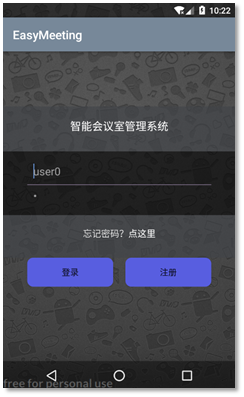
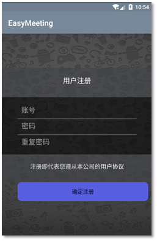
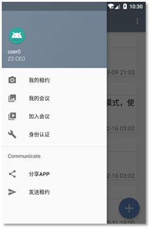
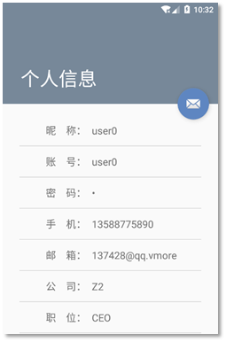
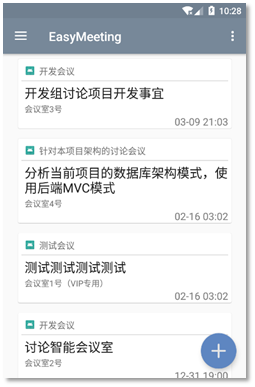
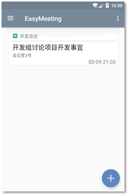
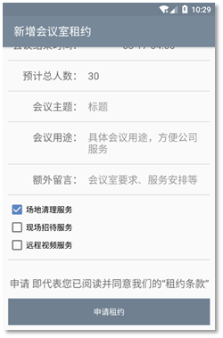
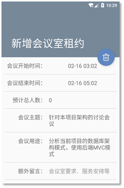
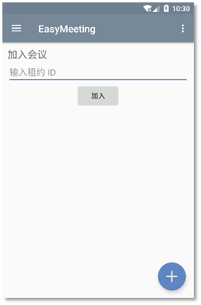
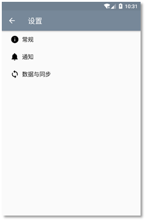

### 3.4.2 Android端

#### 1、用户登录/注册

打开APP，首页之前会要求登录或者注册，如图所示，输入用户名和密码。

APP上只支持用户账号登录。点击登录，即可进入主页面，默认为会议室租约订单列表。点击注册，则跳转到用户注册界面，如图所示。

#### 2、个人信息管理

在侧滑菜单中，包括了显示用户资料，包括昵称、职位等，可以在策划菜单中点击头像，进入用户信息界面，如图所示。

用户信息包括昵称、账号、密码、手机、邮箱、公司、职位、信用度等，点击某一项即可输入，并且做了安全验证和格式验证，避免输入错误的内容，或者SQL注入攻击等。

#### 3、会议室租约

用户登录后，就能看到自己所有的会议室租约信息，每条租约显示会议主题、会议用途、具体会议室地点、会议时间。每条租约信息按照时间逆序排序，从最新到最久。

侧滑菜单中有四个界面，分别为：租约列表、我的会议、加入会议、身份认证。默认界面是租约列表，在侧滑菜单中任意切换“所有租约”和“我的会议”。

编辑右下角的加号按钮，进入添加会议室租约的界面。为了便捷起见，用户不需要手动选择会议室，只有默认的“智能匹配会议室”选项。从列表中点击某一项，则会进入编辑租约的界面。添加和编辑分别如下图所示: 

在租借会议室时，程序会智能判断当前时间，并且通过分析以往的会议室租借历史，来选择最合适的时间，尽量避免用户手动修改。或者可以通过点击出现的时间，进入选择日期和时间界面，手动修改开始、结束时间。

#### 4、加入会议

加入会议的方法，Android端与Web端一样，只需要通过输入会议ID便能够加入，如图所示。

#### 5、应用设置

每一个APP都有自己的应用设置，EasyMeeting提供了简单移动的原生设置界面。设置分为三类，分别是常规、通知、数据与同步。常规中有一些常用的选项，比如租借会议室时是否智能调整时间、显示的信息、自动同意会议邀请等。在“通知”选项中，确认开启会议前一小时通知，避免错过会议时间。而在“数据与同步”中，可以设置用户数据与租约的同步间隔，避免在其他设备上做了修改而导致本设备数据过期。

